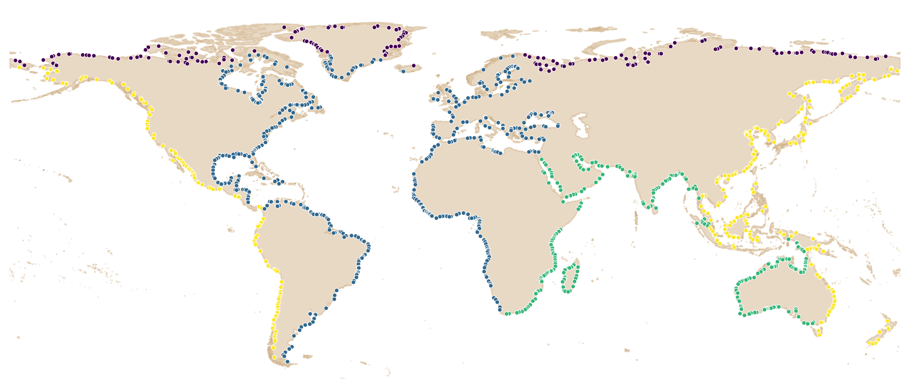

# State of the Climate in 2024

Data processing and figures for the chapter _Global Climate_ in the report _State of Climate in 2024_ (Bulletin of the American Meteorological Society).

## Data

The **river discharge** and **runoff** data are the results from the [GloFASv4 (Global Flood Awareness System)](https://confluence.ecmwf.int/display/CEMS/Latest+operational+GloFAS+release) historical run, extracted from the [Copernicus Early Warning Data Store](https://ewds.climate.copernicus.eu/). The simulation spans from 1979 up until present, with 3 arc-minute spatial resolution and daily temporal resolution. It is produced by forcing the calibrated [LISFLOOD-OS](https://ec-jrc.github.io/lisflood/) hydrological model with the meteorogy from ERA5.

The El Niño-Sourthern Oscillation (ENSO) ONI index was retrieved from https://origin.cpc.ncep.noaa.gov/products/analysis_monitoring/ensostuff/ONI_v5.php.

The Pacific Decadal Oscillation (PDO) was retrieved from: https://www.ncei.noaa.gov/pub/data/cmb/ersst/v5/index/ersst.v5.pdo.dat

## Methods

### Discharge

#### River outlets

To define the river outlets into the four oceans (Atlantic, Pacific, Indian and Arctic), I used the [GloFAS static maps](https://data.jrc.ec.europa.eu/dataset/68050d73-9c06-499c-a441-dc5053cb0c86) that define the catchment area and local drainage directions (LDD). I screened the model pixels which have at least 5,000 km2 catchment area and are sinks in the LDD (value 5). That selection included the outlets of endorheic catchments, which were removed from the final set of river outlets. Each river outlet was assigned to an ocean using as reference the marine areas from [Natural Earth](https://www.naturalearthdata.com/downloads/10m-physical-vectors/10m-physical-labels/). The final selection of river outlets includes 1310 points.

***Figure 1**. River outlets selected to compute the discharge into the oceans. Colours represent the ocean basins.*

### Runoff

