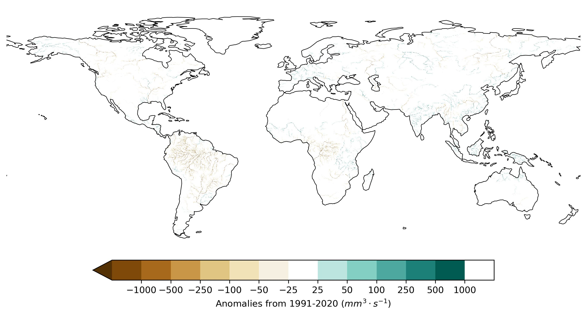
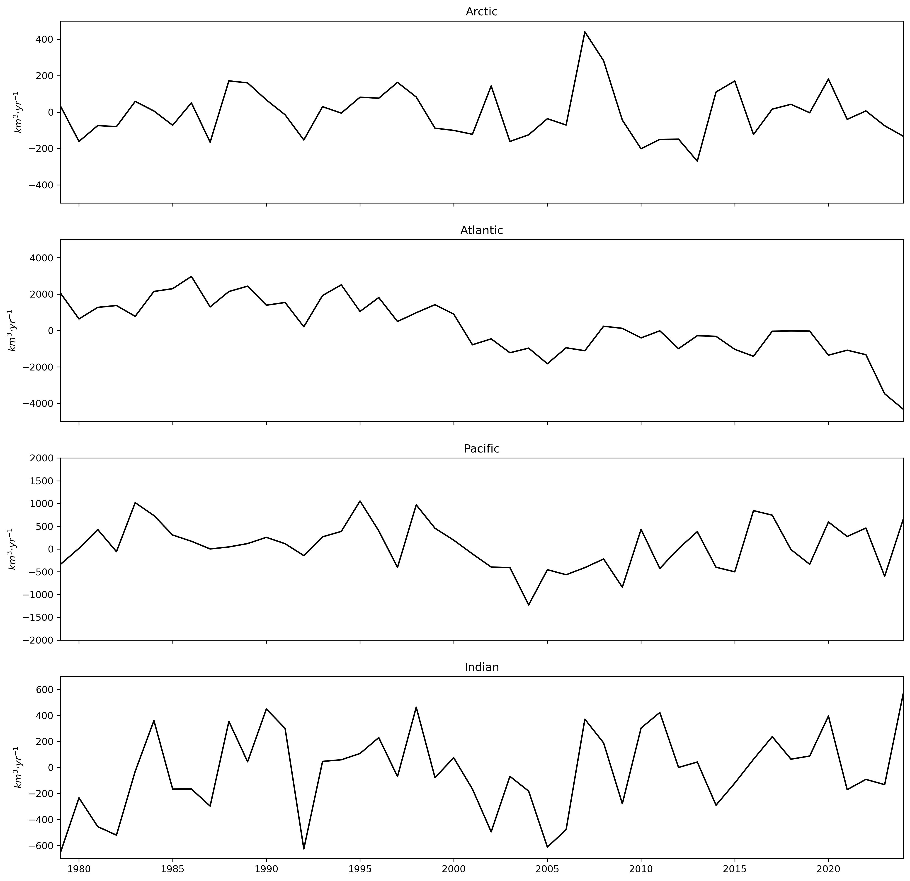
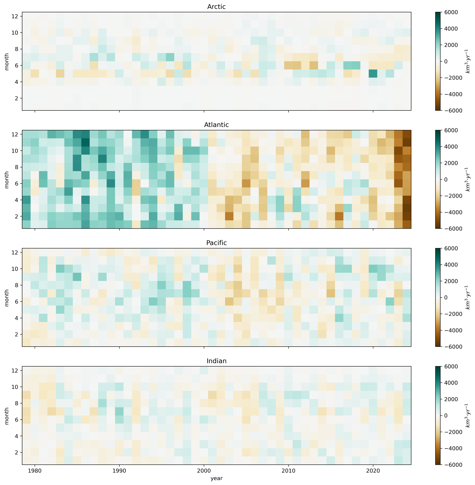
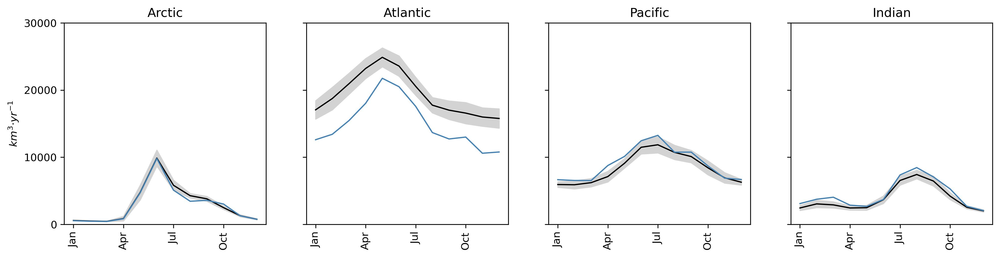

This folder contains the processed data required to produce the figures in the report related to river discharge:

* ***discharge_anomaly.zip*** contains a NetCDF file with a map of the difference between the river discharge in 2024 and the average in the period 1991-2020.

***Figure 1**. River discharge anomaly in 2024 with respect to the reference period 1991-2020.*

* ***discharge_annual_anomaly_by_ocean.csv*** contains a yearly time series of discharge anomaly (km3/year) from 1979 to 2024 compared with the period 1991-2020, disaggregated by ocean . These data is meant to be used to generate the lineplots of interannual variability of freshwater discharge.

***Figure 2**. Interannual variability of freshwater discharge; annual values.*

* ***discharge_montly_anomaly_by_ocean.nc*** contains the monthly time series of discharge anomaly (km3/year) from 1979 to 2024 compared with the monthly averages in the period 1991-2020, disaggregated by ocean. These data is meant to generate the background colormap of interannual variability of freshwater discharge.

***Figure 3**. Interannual variability of freshwater discharge; monthly values.*

* ***discharge_seasonality_by_ocean.nc*** contains the monthly climatology of dicharge (mean and standard deviation) for the period 1991-2020, and the monthly values in 2020; values are disaggregated by ocean. These data is meant to generate the plot of seasonality of freshwater discharge.

***Figure 4**. Seasonality of freshwater discharge.*