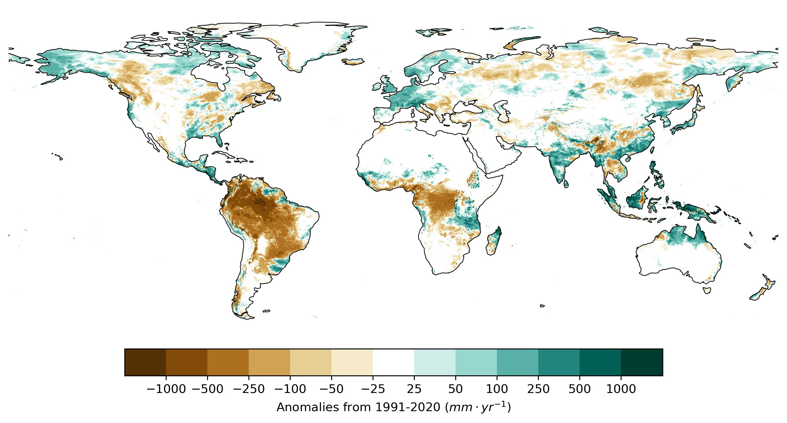

This folder contains the processed data required to produce the figures in the report related to runoff:

* ***runoff_anomaly.zip*** contains a NetCDF file with a map of the difference between the runoff in 2024 and the average in the period 1991-2020.

***Figure 1**. Runoff anomaly in 2024 with respect to the reference period 1991-2020.*