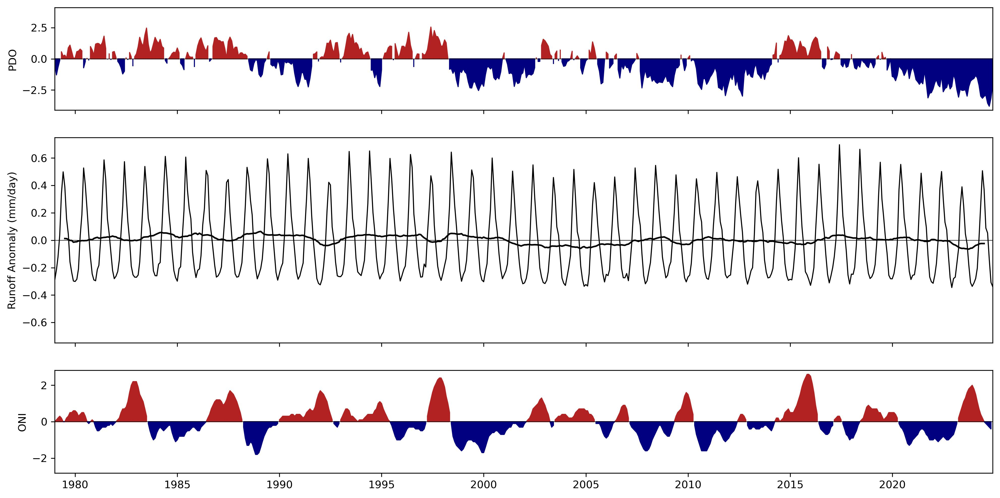

This folder contains the processed data required to produce the figures in the report related to runoff:

* ***runoff_anomaly.zip*** contains a NetCDF file with a map of the difference between the runoff in 2024 and the average in the period 1991-2020.

***Figure 1**. Runoff anomaly in 2024 with respect to the reference period 1991-2020.*

* ***runoff_interannual_variability.csv*** contains the monthly time series of global runoff anomaly (mm/day), the ENSO ONI index, and the PDO index.

***Figure 2**. Interannual variability of the global average runoff (mm/day) and comparison with the ENSO ONI and PDO indices.*