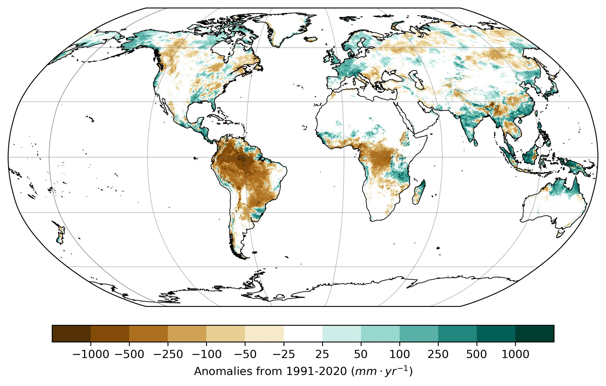
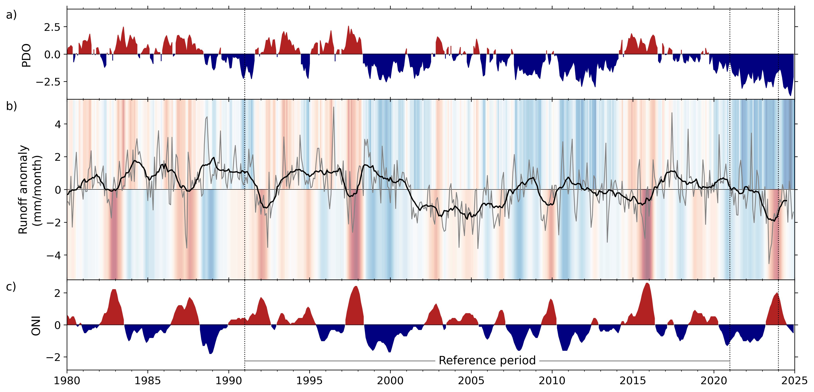

This folder contains the processed data required to produce the figures in the report related to runoff:

* ***runoff_anomaly.zip*** contains a NetCDF file with a map of the difference between the runoff in 2024 and the average in the period 1991-2020.

***Figure 1**. Runoff anomaly in 2024 with respect to the reference period 1991-2020.*

* ***runoff_interannual_variability.csv*** contains the monthly time series of global runoff anomaly (mm/day), the ENSO ONI index, and the PDO index.

***Figure 2**. Interannual variability of global runoff (central panel) and its connections with the Pacific Decadal Oscillation (PDO; upper panel) and the Oceanic Niño Index (ONI; lower panel). In the central panel, the grey line represents the monthly time series, the black line the 12-month moving average, and the shading indicates the phase of the two indices (PDO in the upper part and ONI in the lower).*